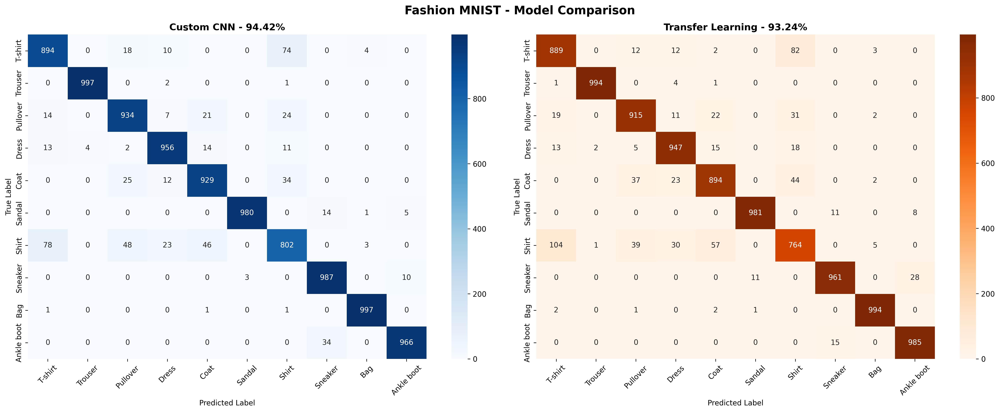
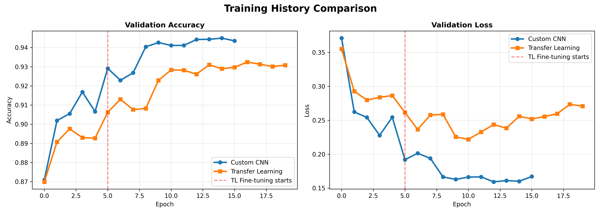
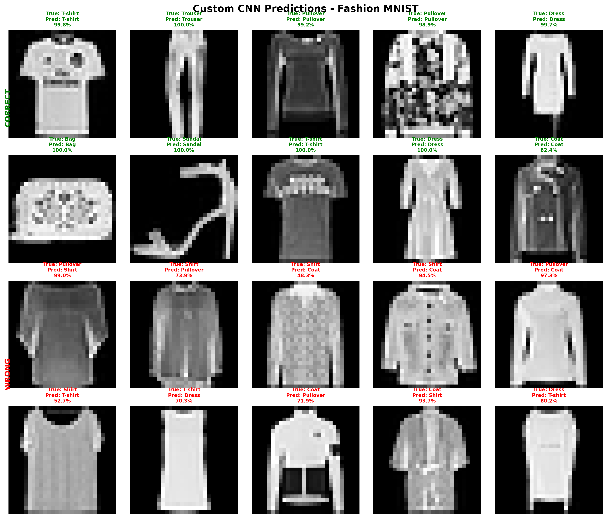

# Fashion MNIST Classification

## Model Comparison: Custom CNN vs Transfer Learning

### Results Summary

| Model | Accuracy | Parameters | Size | Speed |
|-------|----------|------------|------|-------|
| Custom CNN | 94.42% | 619,114 | 2.36 MB | 9s/epoch |
| MobileNetV2 TL | 93.24% | 3,700,000 | 14 MB | slower |

**Winner: Custom CNN** - simpler model wins on small grayscale images!

### Dataset
- 70,000 grayscale images (28x28 pixels)
- 10 fashion categories
- 60,000 training / 10,000 testing
- Perfectly balanced (6,000 per class)

### Classes
0: T-shirt/top 5: Sandal
1: Trouser 6: Shirt
2: Pullover 7: Sneaker
3: Dress 8: Bag
4: Coat 9: Ankle boot

### Per Class Performance (Custom CNN)

| Class | Accuracy | Notes |
|-------|----------|-------|
| Trouser | 99.7% | Unique shape |
| Bag | 99.7% | Rectangular, distinct |
| Sandal | 98.0% | Open design |
| Ankle boot | 96.6% | High ankle shape |
| Shirt | 80.2% | Hardest - similar to T-shirt |

### Key Findings

**Why Custom CNN beat Transfer Learning:**
- Fashion MNIST images are tiny (28x28)
- Images are grayscale, not color
- ImageNet features (color, large scale) not applicable
- Simpler model fit for purpose wins

**Transfer Learning only won on:**
- Sandal (98.1% vs 98.0%) - ImageNet has shoe images
- Ankle boot (98.5% vs 96.6%) - same reason

**Hardest class: Shirt (80.2%)**
- Visually similar to T-shirt and Pullover
- Collar and buttons = 1-2 pixels at 28x28
- Fundamental resolution limitation

### Architecture

**Custom CNN:**
Input (28, 28, 1)
Block 1: Conv2D(32) x2 + BatchNorm + MaxPool + Dropout
Block 2: Conv2D(64) x2 + BatchNorm + MaxPool + Dropout
Block 3: Conv2D(128) x2 + BatchNorm + MaxPool + Dropout
Flatten → Dense(256) → Dense(128) → Dense(10, softmax)

**Transfer Learning:**
Input (96, 96, 3) [upscaled + grayscale to RGB]
MobileNetV2 (frozen) → GlobalAveragePooling2D
Dense(256) + BatchNorm + Dropout
Dense(128) + BatchNorm + Dropout
Dense(10, softmax)

### Training Strategy
- Early stopping (patience=3)
- Model checkpointing (saves best model)
- ReduceLROnPlateau (halves LR on plateau)
- CSV logging (crash recovery)

### Quick Start
```python
import tensorflow as tf
import numpy as np

model = tf.keras.models.load_model('model/cnn_best_model.keras')

# Predict single image
# image shape: (28, 28, 1), normalized 0-1
prediction = model.predict(image[np.newaxis, ...])
class_idx = np.argmax(prediction)
```

### Results




---

**Author:** Farhan Bin Hossain
**GitHub:** @farhanbin65