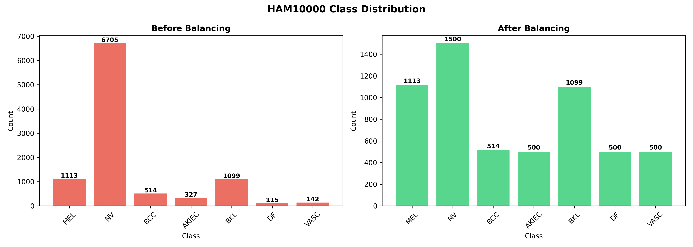
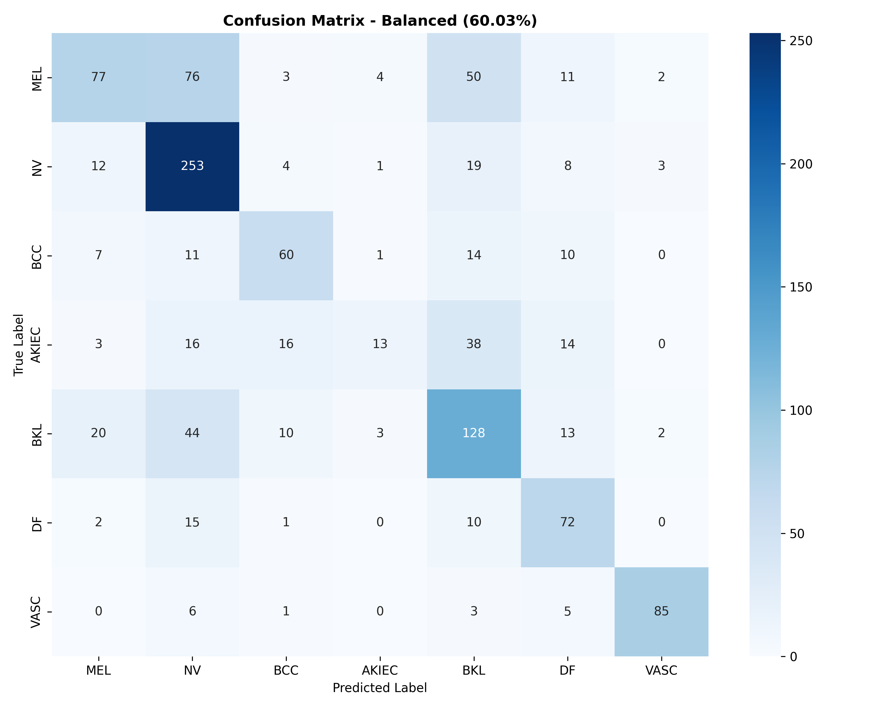
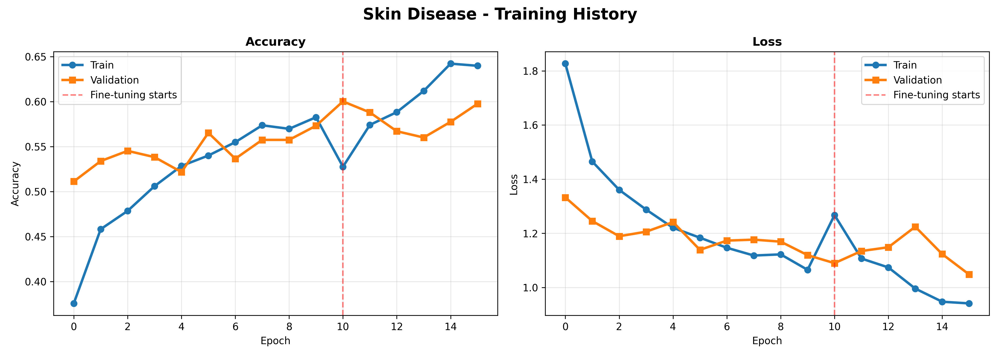

# Skin Disease Classification - HAM10000

Medical AI for skin lesion classification using Transfer Learning

## Dataset

HAM10000 - Human Against Machine 10000
- 10,015 dermatoscopic images
- 7 disease classes
- Source: ISIC Archive

## Classes

| Code | Full Name | Risk Level |
|------|-----------|------------|
| MEL | Melanoma | HIGH - Malignant |
| NV | Melanocytic nevi | LOW - Benign |
| BCC | Basal cell carcinoma | MEDIUM |
| AKIEC | Actinic keratoses | MEDIUM - Precancerous |
| BKL | Benign keratosis | LOW |
| DF | Dermatofibroma | LOW |
| VASC | Vascular lesions | LOW |

## Results

| Metric | Before Balancing | After Balancing |
|--------|-----------------|-----------------|
| Accuracy | 68.75% | 60.03% |
| Macro F1 | 0.36 | 0.57 |
| VASC F1 | 0.41 | 0.89 |
| DF F1 | 0.12 | 0.62 |
| MEL F1 | 0.34 | 0.45 |

## Key Challenge - Class Imbalance
Original distribution:
NV: 6705 (67%) - dominant class
MEL: 1113 (11%)
BKL: 1099 (11%)
BCC: 514 (5%)
AKIEC: 327 (3%)
VASC: 142 (1%)
DF: 115 (1%)

Solution:

Undersample NV: 6705 → 1500
Oversample rare classes to 500 minimum

## Key Finding
Overall accuracy dropped: 68.75% → 60.03%
Macro F1 improved: 0.36 → 0.57

In medical AI, macro F1 matters more than accuracy!
A model that ignores rare cancers is dangerous
even if its overall accuracy looks high.

## Architecture
Input (128, 128, 3)
MobileNetV2 (Pretrained - ImageNet)
GlobalAveragePooling2D
Dense(512) + BatchNorm + Dropout(0.5)
Dense(256) + BatchNorm + Dropout(0.4)
Dense(128) + Dropout(0.3)
Dense(7, softmax)


## Training Strategy

- Phase 1: Feature extraction (base frozen, LR=0.001)
- Phase 2: Fine-tuning (last 30 layers, LR=0.00005)
- Vertical flip augmentation (lesions have no fixed orientation)
- Early stopping (patience=5)
- Model checkpointing

## Quick Start

```bash
# Train model
python train.py

# Evaluate model
python evaluate.py

# Predict single image
python predict.py --image path/to/lesion.jpg
```

## Results





## Disclaimer

This tool is for educational and research purposes only.
Always consult a qualified dermatologist for medical diagnosis.

---

**Author:** Farhan Bin Hossain
**Dataset:** HAM10000 (ISIC Archive)
**GitHub:** [@farhanbin65](https://github.com/farhanbin65)